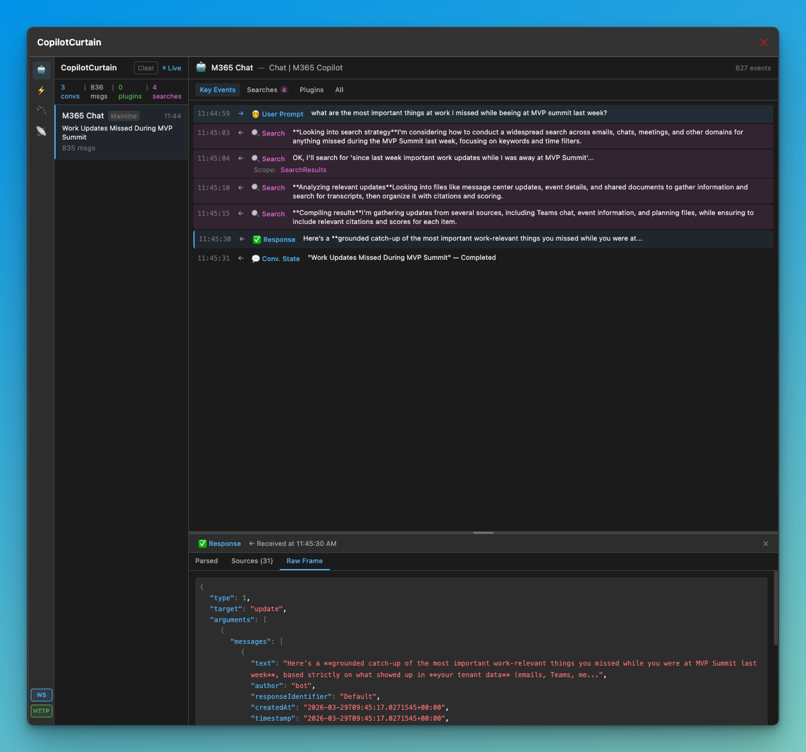

# CopilotCurtain

A Chrome/Edge developer extension that makes M365 Copilot's internal communication visible. See exactly what happens when Copilot processes a prompt: the search queries, grounding sources, plugin invocations, streaming tokens, sensitivity labels, and the full prompt-to-response pipeline — all decoded in real-time from the WebSocket protocol.

Built for developers building Copilot plugins and declarative agents, IT pros auditing data access, and anyone who wants to understand how M365 Copilot actually works under the hood.



## What It Does

CopilotCurtain attaches to Copilot's SignalR WebSocket connection (`substrate.office.com`) via Chrome DevTools Protocol and decodes every frame in real-time:

| Feature | Description |
|---------|-------------|
| **WebSocket Decoder** | Decodes Copilot's SignalR JSON protocol — handshakes, streaming tokens, snapshots, progress messages, and completion signals |
| **Source Attribution** | Parses `sourceAttributions` with full `referenceMetadata` — file type (Word, PowerPoint, Email, Teams Chat, Meeting, etc.), author, data source, citation references |
| **Search Visibility** | Shows Copilot's search progress messages and tracks how `sourceAttributions` accumulate during grounding (2 → 5 → 11 → 62 sources) |
| **Agent Detection** | Automatically identifies declarative agent conversations vs. mainline chat via `gpts[]` and `threadLevelGptId` in the prompt payload |
| **Sensitivity Labels** | Surfaces Microsoft Information Protection labels on conversations (e.g. "Intern", "Allgemein") |
| **Conversation Flow** | Visual pipeline view: Prompt → Search → Streaming → Response → Sources, with timing between each stage |
| **Plugin Inspector** | Plugin registry from `/userconfig`, invocation tracking with request/response correlation |
| **HTTP Traffic** | Captures Copilot-related HTTP calls (Graph, Substrate, plugin APIs, auth) with header redaction |

## Who Is This For?

- **Copilot Plugin / Agent Developers** — Debug the full conversation lifecycle, see how your agent is invoked, inspect the raw frames
- **IT Pros / Compliance** — Audit what data Copilot accesses, verify sensitivity labels, review source attributions
- **M365 Consultants** — Demonstrate and explain Copilot's internal behavior to customers
- **Copilot Readiness Teams** — Validate data quality and grounding before tenant-wide rollout

## Installation

```bash
git clone https://github.com/thomyg/CopilotCurtain.git
cd CopilotCurtain
npm install
npm run build
```

### Load in Chrome/Edge

1. Open `chrome://extensions/` (Chrome) or `edge://extensions/` (Edge)
2. Enable **Developer mode**
3. Click **"Load unpacked"**
4. Select the `dist/` folder

## Usage

1. Click the CopilotCurtain icon in your browser toolbar
2. Toggle **WS** (WebSocket capture) ON
3. Open the side panel dashboard
4. Open M365 Copilot in another tab and start a conversation
5. Watch the conversation appear in real-time — prompts, search progress, streaming, sources, and the final response

### Views

- **Timeline** — Filterable event list (Key Events, Searches, Plugins, All) with collapsible streaming chunks and full detail pane (Parsed / Sources / Raw Frame with JSON tree viewer)
- **Flow** — Visual pipeline diagram showing the conversation stages with timing between steps
- **Plugins** — Plugin registry with health metrics and invocation history
- **HTTP** — Virtualized HTTP traffic list with category filtering

### Key Details

- **WebSocket capture requires `chrome.debugger`** — the browser will show a debugging banner on captured tabs. This is the only way to access WebSocket frame payloads in Manifest V3.
- **Tokens are redacted** — Bearer tokens, cookies, and sensitive headers are automatically truncated.
- **All data stays local** — stored in browser IndexedDB. Nothing is sent externally.

## Tech Stack

- **TypeScript** + **React 18** + **Tailwind CSS**
- **Vite** for building
- **Zustand** for state management
- **idb** for IndexedDB
- **@tanstack/react-virtual** for virtualized lists
- **Chrome Manifest V3** with `webRequest` + `debugger` APIs

## Development

```bash
npm run dev      # Vite dev server
npm run build    # Production build -> dist/
npm run zip      # Build + zip for distribution
```

## Contributing

Contributions welcome. Areas that need work:

- [ ] SignalR MessagePack binary frame decoding
- [ ] Session export (JSON/Markdown reports)
- [ ] Adaptive card rendering preview
- [ ] Multi-turn conversation correlation improvements
- [ ] Copilot Studio agent debugging (topic routing, knowledge sources)
- [ ] Prompt simulator for plugin selection testing

## License

MIT

## Disclaimer

This is an independent community tool, not affiliated with or endorsed by Microsoft. CopilotCurtain observes Copilot's WebSocket protocol for debugging and educational purposes. The protocol is undocumented and may change at any time without notice.

**This project is vibe-engineered** — built rapidly with AI assistance to explore what's possible. It works, but it needs more testing across different Copilot surfaces, tenant configurations, and edge cases. Use it as a development and learning tool, not as production monitoring infrastructure. Bug reports and contributions are welcome.
